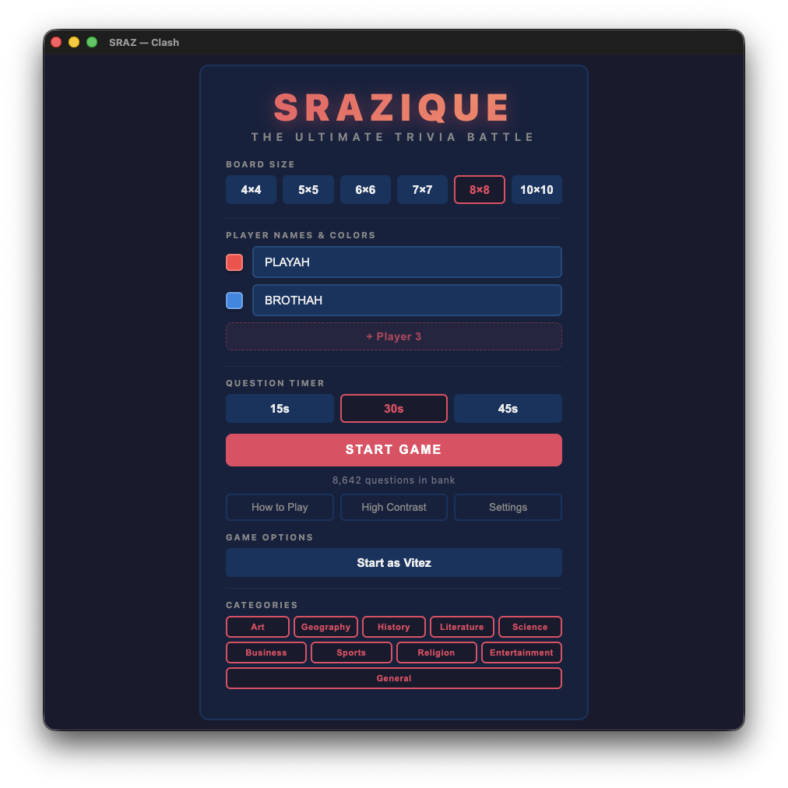
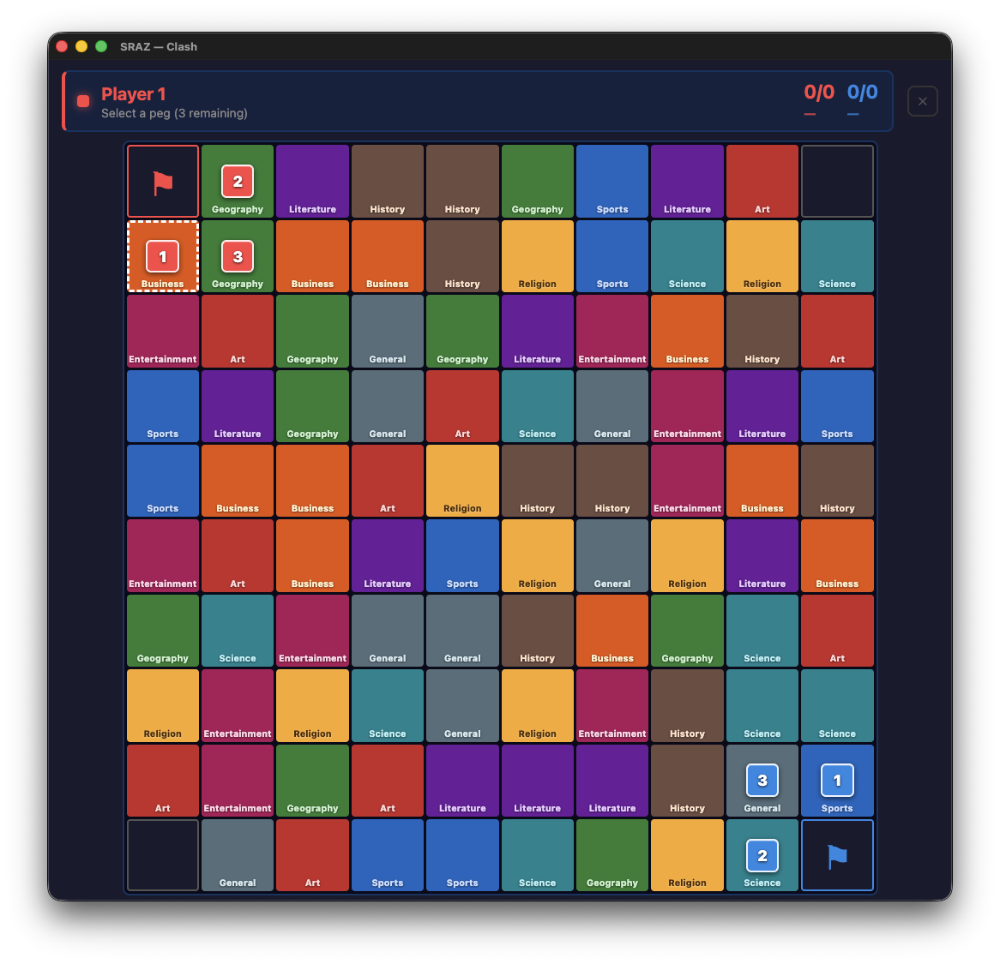
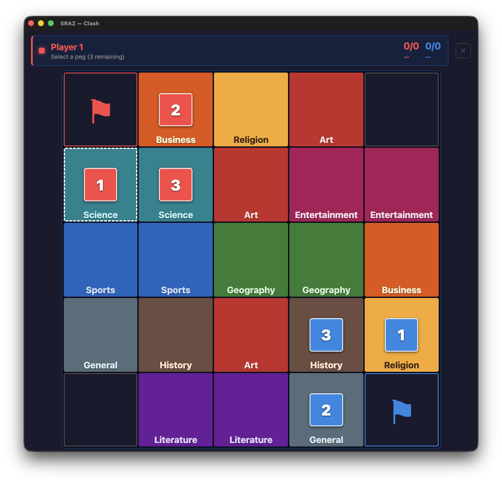
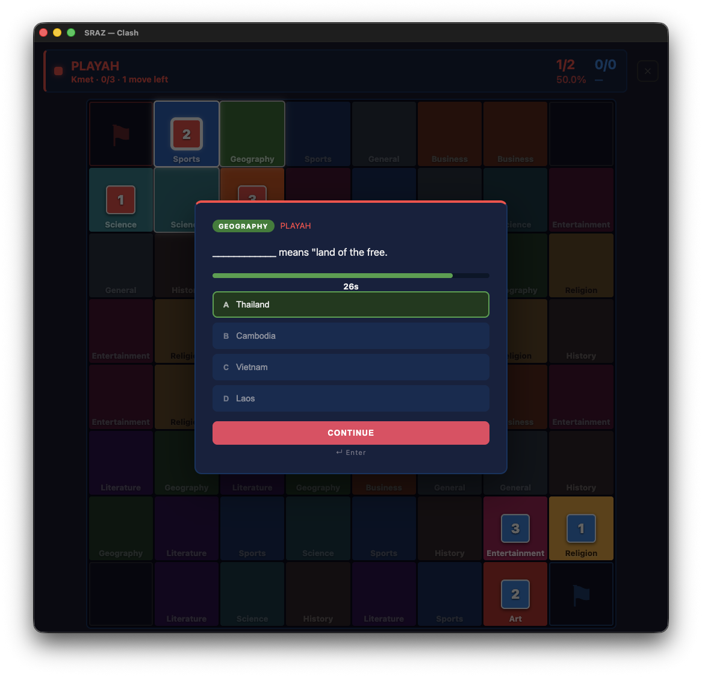
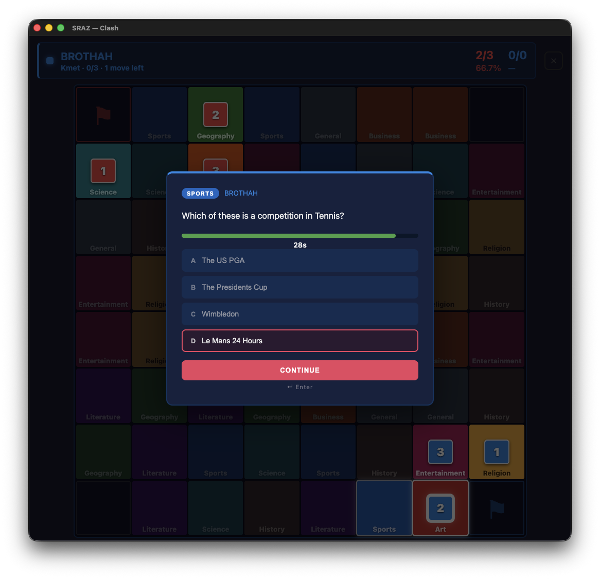

# Srazique

A modern resurrection of **Sraz**, the classic DOS-era strategy board game. Srazique brings back the original gameplay with updated visuals, built with Electron.

This project was born out of a deep passion for quiz games and countless hours spent playing the original Sraz with friends — until we had memorized every question and started longing for a fresh set. Rather than just updating the question bank, I decided to rebuild the whole thing from scratch.

> For the best overview of the original 1993 DOS game, see: [Sraz (1993) — prvi domaći kviz znanja na računalu koji je spojio igru i učenje](https://virus.hr/en/sraz-1993-prvi-domaci-kviz-znanja-na-racunalu-koji-je-spojio-igru-i-ucenje/)

## Screenshots

> Game Setup

> Board 10x10

> Board 5x5

> Correct Answer

> Wrong Answer

## Features

- 2-4 player local multiplayer
- 4x4, 8x8, or 10x10 game board with category-based tiles
- 8,600+ unique questions across 10 categories — no repeats within a game
- Combat system with rank progression — higher rank wins regardless of answer
- Flag capture mechanics
- Countdown timer per answer (15, 30, or 45 seconds)
- Keyboard navigation (A/B/C/D or 1/2/3/4 for answers, arrow keys for board)

## Installation

## Test Setup

The project uses **Vitest** for unit testing.  Read the [official Vitest docs](https://vitest.dev) for more details.

- The project uses **Vitest** for unit testing.  Read the [official Vitest docs](https://vitest.dev) for more details.

- The project uses **Vitest** for unit testing.  Read the [official Vitest docs](https://vitest.dev) for more details.

## Known Limitations

- **Coverage limitation**: When running tests with **Vitest** in the repository’s `vm2` sandbox, the CI‑defined coverage thresholds are **ignored** by Vitest. The CI still reports a passing status even if the actual coverage drops below the target.

- **macOS** — download and open the `.dmg` file, then drag Srazique to your Applications folder

## License

MIT
